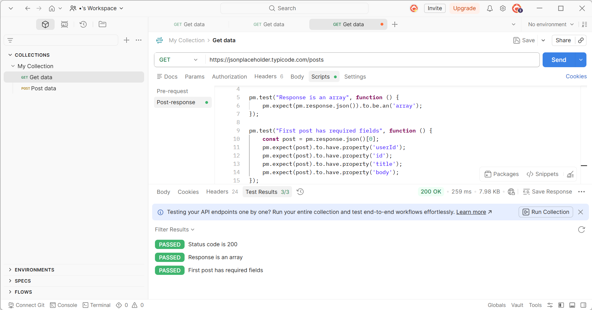

## API Testing — JSONPlaceholder

Postman collection testing the `/posts` endpoint of JSONPlaceholder API.

**Tests implemented:**
- Status code validation (200 OK)
- Response type validation (array)
- Schema validation (required fields: userId, id, title, body)

All 3 tests passing.

To run: import `My Collection.postman_collection.json` into Postman.
